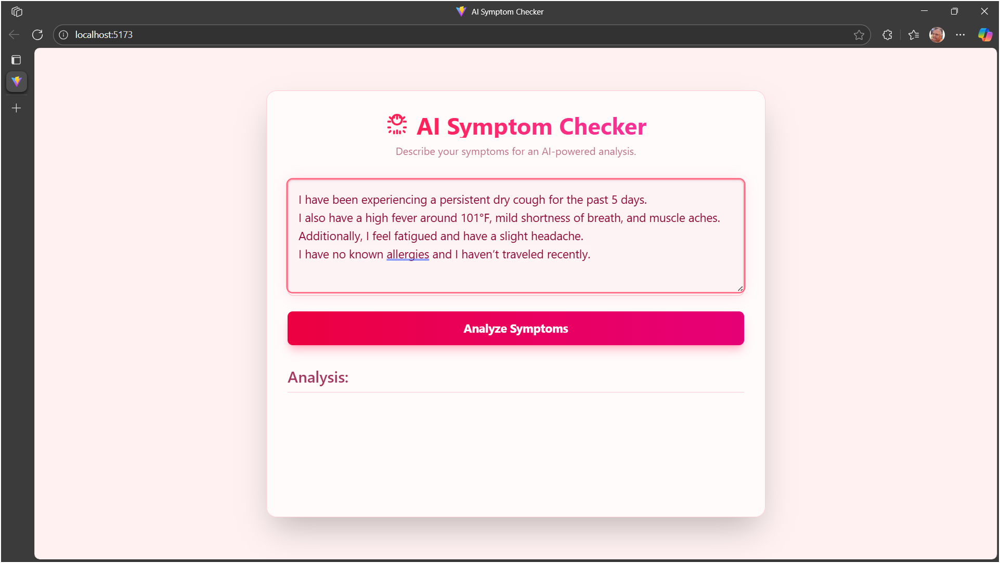

# 🩺 AI Symptom Checker

A sophisticated, full-stack web application that leverages **Large Language Models (LLMs)** to provide users with an **AI-powered analysis of their medical symptoms**.  
This project features a polished, animated React frontend and a robust Python Flask backend, demonstrating a complete end-to-end development cycle.

---

## 🌟 About The Project
In an age of information, finding reliable and immediate preliminary health insights can be challenging.  
The **AI Symptom Checker** was built to address this by providing a simple, intuitive interface where users can describe their symptoms in natural language and receive an instant, AI-generated analysis.

### This tool is designed **for informational purposes**, empowering users with potential avenues of inquiry and structured questions to ask a healthcare professional.

This project showcases a range of modern development practices — from building a beautiful, responsive frontend with **React** and **Framer Motion**, to architecting a scalable **Python backend**, and integrating a powerful **LLM** with carefully engineered prompts.

---

## 🎬 Demo Video

Check out the full demo of the **AI Symptom Checker** in action!  


[Watch the Demo Video](https://youtu.be/kNJ3MY0VRoo)

## 🛠️ Built With

### Frontend
- React  
- Vite  
- Tailwind CSS  
- Framer Motion (for animations)

### Backend
- Python  
- Flask  
- Groq API (for LLM inference)

### Database
- SQLite

---

## ✨ Core Features
- **Real-time Symptom Analysis:**  
  Utilizes the Groq API for incredibly fast, real-time analysis of user-inputted symptoms.


  ## 📝 Input / Output Examples

### Case 1: Valid Symptom Input
 


**AI Analysis:**  


**Suggested Questions for Doctor:**  


---

### Case 2: Non-Valid Symptom Input
**Input:** "I feel weird."  


---

### Case 3: Short Symptom Input
**Input:** "Cough."  


- **Structured & Actionable Insights:**  
  The AI provides structured responses, including probable conditions, explanations, and recommended next steps.

- **Copy Analysis:**  
  Users can copy the AI’s analysis with a single click.

- **Prepare Questions for Doctor:**  
  After the analysis, the AI generates **structured questions** for the user to ask a healthcare professional, displayed in a clean pop-up modal.

## 💾 Database & Data Logging

All user queries and AI responses are stored locally in an SQLite database.  
This allows the application to log interactions for future analysis or potential fine-tuning of AI models.

**Database Screenshot:**  


- **Aesthetic & Responsive UI:**  
  A custom **Rose Gold** themed, light-mode interface that is fully responsive and enhanced by smooth **Framer Motion** animations.

- **Data Persistence:**  
  All queries and AI responses are logged into a local SQLite database, creating a dataset for potential future analysis.

---

## 🚀 Getting Started

To get a local copy up and running, follow these simple steps.

### 🧩 Prerequisites
```text
- Python 3.x  
- Node.js and npm  
- An API key from Groq
```

---

## 1️⃣ Clone the Repository
```bash
git clone https://github.com/shanmukhsainandavarapu/Health_ai-symptom-checker.git
cd Health_ai-symptom-checker
```

---

## 2️⃣ Backend Setup

### Navigate to the backend directory
```bash
cd backend
```

### Create a .env file and add your Groq API key
```bash
echo GROQ_API_KEY="YOUR_GROQ_API_KEY_HERE" > .env
```

### Install Python dependencies
```bash
pip install -r requirements.txt
```

### Run the Flask server
```bash
python app.py
```

### Backend Running URL
```text
http://127.0.0.1:5000
```

---

## 3️⃣ Frontend Setup

### Navigate to the frontend directory
```bash
cd frontend
```

### Install dependencies
```bash
npm install
```

### Run the React development server
```bash
npm run dev
```

### Frontend Running URL
```text
http://localhost:5173
```

---

## 🏛️ Architectural Overview
```text
The application is built on a robust client-server model, ensuring a clear separation of concerns.
```

---

### 🖥️ Frontend Architecture
All UI components and logic (analysis form, loading skeleton, Aurora background, modal, copy button, prepare questions) are consolidated into a single `App.jsx` file for simplicity and fast prototyping.

- **State Management:** via React Hooks (useState)  
- **Component Logic:** Form, modal, loading skeleton, copy button, prepare questions  
- **API Communication:** Calls backend endpoints `/check_symptoms` and `/prepare_questions`

---

### ⚙️ Backend Architecture
The backend is a lightweight Flask server responsible for AI processing and data management.

#### Key Files
```text
app.py
- Defines main API endpoints:
  - /check_symptoms → Receives the user’s query
  - /prepare_questions → Generates follow-up doctor questions

llm_integration.py
- Handles all interactions with the Groq API and prompt engineering.

database.py
- Manages SQLite database creation and logs query/response data.
```

---

## 🧠 AI Integration & Gatekeeper

### 🔒 Integrated Gatekeeper
The backend enforces a strict rule: the AI will only analyze **medical symptoms**.  
If the user input does not describe symptoms, the AI responds only with:

> "This tool is designed for medical symptom analysis only."

This ensures safety and keeps the tool strictly informational.

### 📑 Frontend Gatekeeper Fallback
The frontend validates responses as a fallback using your original logic:
```js
const refusalMessage = "This tool is designed for medical symptom analysis only.";
if (!data.response.includes(refusalMessage)) {
    setIsAnalysisSuccessful(true);
}
```

---

## 🔬 Data Science Perspective
```text
Beyond being a functional web app, this project also lays the groundwork for data-driven insights.
```

### 🧾 Data Collection
Every query and AI response is automatically logged into an SQLite database — forming a structured dataset for future analysis.

### 📊 Potential Analyses
With this data, you can explore:
- Most commonly reported symptoms  
- Correlations between symptom groups  
- Consistency of AI analyses over time

### 🚀 Future Work
A future version of this project could use this data to fine-tune a smaller, open-source model specialized for medical symptom checking — improving accuracy and lowering costs.

The database.py module is the first step toward that vision.
